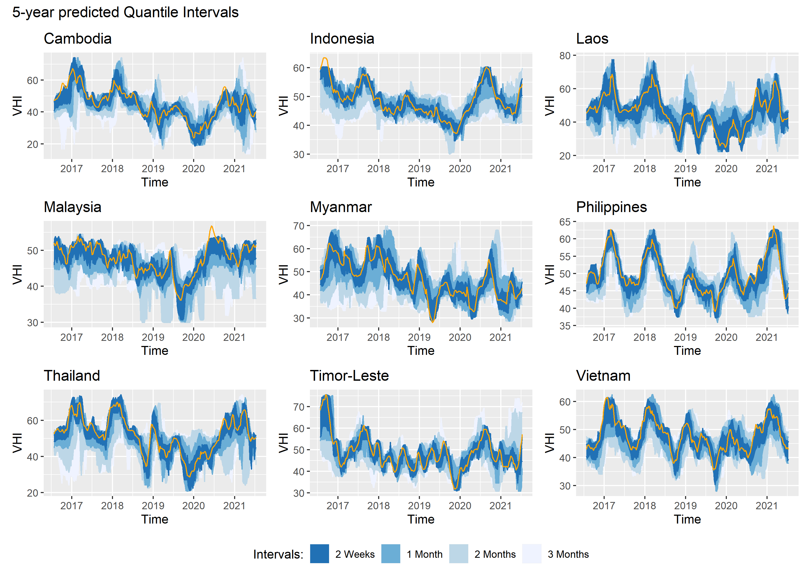

## Main code for the paper "Probabilistic prediction of remotely sensed crop health and its food security implications" written by Ahmed T. Hammad, and Giacomo Falchetta"

**ABSTRACT**

In a world where climate change, population growth, and global diseases threaten economic access to
food, food security policies and contingency plans can strongly benefit from reliable predictions of future
crop health. Here we design and implement a probabilistic machine learning framework to anticipate
remotely sensed agricultural vegetation health based on previous weather conditions while making the
underlying uncertainty explicit. We implement the approach in nine countries of South-East Asia (SEA)
and show that our predictions can provide decision-makers with reliable information about future crop
health weeks or even months ahead, albeit with increasing uncertainty as the forecast horizon grows. In
addition, we demonstrate that the SEA crop health predictions have a robust statistical link with national
monthly rice prices, allowing to anticipate the impact of weather shocks on household food expenditure.
Our results contribute to the multidisciplinary literature linking vegetation health monitoring, probabilistic
prediction models, and food security policy.

